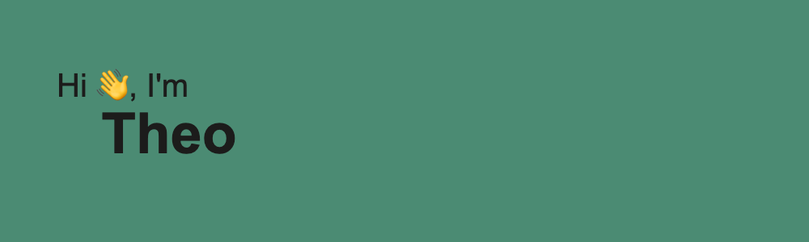

<!---->
# About Me
I'm a student at Northwestern University, studying computer science and philosophy. I'm an aspiring full stack engineer, but I've loved coding for years and my interests really span the breadth of the CS field. Data privacy and system security are currently two core foci for me! I'm passionate about building beautiful, useful, and _secure_ solutions to all sorts of problems.

<h3 align="left">Connect with me:</h3>

<h3 align="left">Languages and Tools:</h3>

           

<!--
**m4ur1n0/m4ur1n0** is a ✨ _special_ ✨ repository because its `README.md` (this file) appears on your GitHub profile.

Here are some ideas to get you started:

- 🔭 I’m currently working on ...
- 🌱 I’m currently learning ...
- 👯 I’m looking to collaborate on ...
- 🤔 I’m looking for help with ...
- 💬 Ask me about ...
- 📫 How to reach me: ...
- 😄 Pronouns: ...
- ⚡ Fun fact: ...
-->
